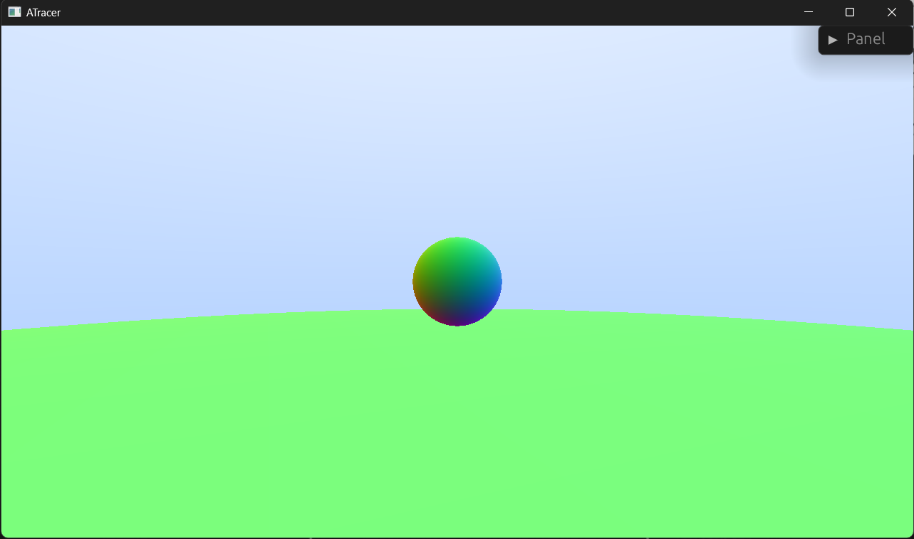

# ATracer

A toy software ray-tracing engine for me to tinker with. I will be using this project to learn things such as window & GUI interactions, multithreading, file I/O, and more.



The project is split into two core parts: [the window](a_tracing_window) and [a raytracing library](a_tracing_window).
As this project is in a fairly early stage the features are pretty limited.

## Features

### Window

#### Implemented
* Resizeable viewport
* Camera movement using **wasd** + **rf**
* Camera orientation change using **qe** for left/right and **zx** for up/down
* Button to start render

#### Planned
* Camera movement using mouse
* Scene editing using mouse
* Extended GUI for rendering settings such as number of samples, sampling method and tracing depth

### Library

#### Implemented
* 2 Rendering methods: 
    * Quick render that completes within a single frame for use during camera movement
    * Long render with full detail
* Spheres
* Basic diffuse material
* Regular multisampling

#### Planned
* Multithreaded rendering
* Triangle meshes with bounding volume hierarchy acceleration structure
* Advanced materials: mirrors/glass/smoke/...
* glTF file import

## Working with the library

The [ATracer struct](a_tracing_lib/src/tracer.rs) is the main entry point of the raytracing engine. 
It contains an internal color buffer where the rendered result is saved in the internal [Color](a_tracing_lib/src/color.rs) format. 
The internal color buffer can be drawn to an external color buffer in RGBA [u8, u8 ,u8 ,u8] format using the ```draw``` method

The [Scene](a_tracing_lib/src/scene.rs) contains the camera, objects and lights that will be used during the rendering. 
Using the tracers ```get_scene_mut``` method the scene can be modified or replaced. 
This will invalidate the current internal color buffer since it no longer matches the edited scene. 

This raytracing library is best used in combination with a window in a way similar to this project. 
For this reason the [ATracer struct](a_tracing_lib/src/tracer.rs) has two rendering methods.
One method will render the scene in full detail according to the selected render settings (see the ```RenderSettings``` struct in the [tracer.rs file](a_tracing_lib/src/tracer.rs).), 
and the other is a quick render method which finishes very quickly so it can be called every single frame of the window. 
This quick render method is best used during movement of the camera or scene edits so these can be visualised in real time. 
Once the user is happy with the scene, the full render can be done.  

When used in a window it is recommended to call ```update``` on the tracer before every ```draw``` call. 
The ```update``` method will perform a quick render should the color buffer be invalidated due to editing the scene or resizing the viewport. 
Once multithreaded rendering is implemented, the ```update``` method will draw every rendered tile to the color buffer as soon as it is available. 
This will make it possible to view the progress of the render in real time instead of having to wait untill the entire viewport is rendered.
